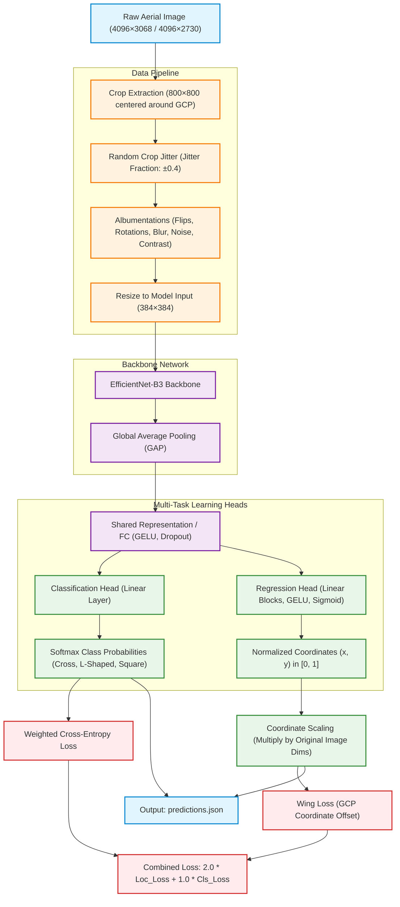

# Aerial GCP Pose Estimation

## Project Overview

This project provides a deep learning pipeline for detecting and classifying Ground Control Points (GCPs) in high-resolution aerial drone imagery.

Given an image containing a GCP marker, the system simultaneously predicts:

1. Marker Shape Class

   * Cross
   * L-Shaped
   * Square

2. Marker Coordinates

   * x coordinate
   * y coordinate

Accurate GCP detection and localization are important for photogrammetry, surveying, and georeferencing workflows.

---

## Repository Structure

```text
.
├── GCP_Pose_Estimation_v3.ipynb
├── checkpoints/
│   └── best_model.pth
├── predictions.json
├── config.json
├── requirements.txt
├── decision_log.md
└── README.md
```

---

## Model Architecture

The final submission uses a multi-task learning architecture built on top of EfficientNet-B3.

### Backbone

* EfficientNet-B3 (ImageNet pretrained)
* Global Average Pooling
* Shared Feature Representation

### Multi-Task Heads

#### Classification Head

Predicts one of three marker classes:

* Cross
* L-Shaped
* Square

#### Regression Head

Predicts normalized marker coordinates:

* x coordinate
* y coordinate

Both tasks are trained jointly to encourage the backbone to learn features useful for classification and localization simultaneously.

### Input Resolution

* Crop Size: 800 × 800
* Model Input Size: 640 × 640

### Why EfficientNet-B3?

EfficientNet-B3 was selected because it provides:

* Excellent classification performance
* Stable convergence
* Efficient GPU utilization
* Faster training on Tesla T4 hardware

---
### Pipeline and Model Diagram


---
## Training Strategy

### Crop-Based Localization

Instead of resizing the original 4096 × 3068 or 4096 × 2730 images directly, local crops centered around the annotated marker are extracted.

This preserves marker details and improves localization accuracy.

### Crop Jitter

A jitter fraction of 0.4 is applied during training.

This prevents the marker from always appearing at the center of the crop and improves localization robustness.

### Data Augmentation

Implemented using Albumentations:

* Horizontal Flip
* Vertical Flip
* RandomRotate90
* Random Brightness / Contrast
* Hue / Saturation / Value Adjustment
* Gaussian Blur
* Gaussian Noise

### Optimizer and Scheduler

Optimizer:

* AdamW

Scheduler:

* OneCycleLR

### Loss Functions

Classification:

* Weighted CrossEntropyLoss

Localization:

* SmoothL1Loss (beta = 0.02)

Combined Loss:

```text
Total Loss =
2.0 × Localization Loss +
1.0 × Classification Loss
```

The localization loss was given a larger weight because classification converged much faster than coordinate regression.

---
## Running Inference Using the Standalone Script

A standalone inference script (`inference.py`) is provided to generate predictions on the test dataset using the trained EfficientNet-B3 checkpoint.

### Generate Predictions

```bash
python inference.py \
    --test_dir dataset/test_dataset \
    --checkpoint checkpoints/best_model.pth \
    --output predictions.json
```

### Required Files

```text
project_root/
├── checkpoints/
│   └── best_model.pth
├── dataset/
│   └── test_dataset/
├── inference.py
└── predictions.json
```

### Script Features

* Loads the trained EfficientNet-B3 model checkpoint.
* Performs preprocessing identical to training.
* Runs inference on all test images.
* Applies Test-Time Augmentation (TTA) for improved robustness.
* Converts normalized predictions back to original image coordinates.
* Generates a predictions.json file matching the training annotation format.

### Output

The script produces:

```text
predictions.json
```

with entries in the format:

```json
{
  "image.jpg": {
    "mark": {
      "x": 1234.56,
      "y": 987.65
    },
    "verified_shape": "Cross"
  }
}
```

### Alternative Notebook Inference

Predictions can also be reproduced directly from the notebook:

1. Open `GCP_Pose_Estimation_v3.ipynb`
2. Load the trained checkpoint
3. Run Section 7 (Test Inference):

   * 7.1 Build Test DataFrame
   * 7.2 Test Dataset
   * 7.3 TTA Inference
   * 7.4 Save predictions.json


## Challenges and Mitigations

### Class Imbalance

Weighted CrossEntropyLoss was used to compensate for differences in class frequencies.

### Full-Image Localization Failure

A full-image regression experiment was conducted.

Although classification achieved near-perfect performance, localization failed because the GCP marker became extremely small after resizing the full-resolution images.

### Center-Bias Collapse

The regression head converged toward predicting coordinates near the dataset mean rather than learning the true marker location.

### Crop-Based Mitigation

Using local crops preserved marker details and enabled meaningful coordinate regression.

This approach was selected for the final submission.

---

## Downloading the Trained Model

The trained model weights are available at:

https://drive.google.com/file/d/1nhoshvUJkrldjF7vom5zKo7CU9-KPG6A/view?usp=sharing

Save the downloaded file as:

```text
checkpoints/best_model.pth
```

---

## Environment Setup

Install dependencies:

```bash
pip install -r requirements.txt
```

---

## Dataset Setup

Expected dataset structure:

```text
dataset/
├── train_dataset/
│   ├── gcp_marks.json
│   └── ...
└── test_dataset/
    └── ...
```

Update the dataset paths in the configuration cell:

```python
CFG = dict(
    TRAIN_DIR="...",
    TEST_DIR="...",
    LABEL_JSON="...",
    CKPT_DIR="..."
)
```

---

## Reproducing Training

1. Open:

```text
GCP_Pose_Estimation_v3.ipynb
```

2. Update the dataset paths.

3. Run all notebook cells sequentially.

The notebook contains:

* Data preparation
* EDA
* Dataset creation
* Model definition
* Training
* Validation
* Inference
* Prediction export

---

## Running Inference

To reproduce predictions using the trained checkpoint:

### Step 1

Download:

```text
checkpoints/best_model.pth
```

### Step 2

Open:

```text
GCP_Pose_Estimation_v3.ipynb
```

### Step 3

Run the notebook from:

```text
Section 7 – Test Inference
```

Execute:

* 7.1 Build Test DataFrame
* 7.2 Create Test Dataset
* 7.3 Test-Time Augmentation (TTA) Inference
* 7.4 Save predictions.json

### Output

```text
predictions.json
```

will be generated automatically.

---

## predictions.json Format

The output file follows exactly the same schema as the training annotations.

Example:

```json
{
  "image.jpg": {
    "mark": {
      "x": 1234.56,
      "y": 987.65
    },
    "verified_shape": "Cross"
  }
}
```

---

## Final Outputs

The project generates:

* checkpoints/best_model.pth
* predictions.json
* config.json
* requirements.txt
* decision_log.md
* README.md

---

## Results Summary

### Classification

* Macro F1 Score ≈ 1.0
* Near-perfect shape classification

### Localization

The crop-based localization pipeline successfully avoided center-bias collapse observed during full-image regression experiments.

### Final Submission Model

* EfficientNet-B3
* Multi-Task Classification + Localization
* Crop-Based Training Pipeline
* SmoothL1Loss for Localization
* Weighted CrossEntropyLoss for Classification
