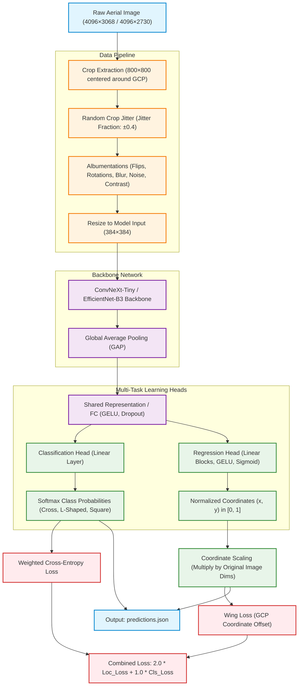

# Aerial GCP Pose Estimation

## Project Overview
This project provides a deep learning pipeline for detecting and classifying **Ground Control Points (GCPs)** in high-resolution aerial drone imagery. Given an image containing a GCP marker, the system simultaneously predicts:
1. **Marker Shape Class**: Categorizes the shape into one of three classes: `Cross`, `L-Shaped`, or `Square`.
2. **Marker Coordinates**: Regresses the precise `(x, y)` pixel coordinates of the marker's center.

Accurate GCP detection and localization are vital components in photogrammetry, surveying, and georeferencing, enabling autonomous drone mapping software to tie aerial images to real-world coordinates.

---

## Repository Structure
```
.
├── GCP_Pose_Estimation_v3.ipynb
├── checkpoints/
│   └── best_model.pth
├── predictions.json
├── config.json
├── requirements.txt
├── decision_log.md
├── inference.py
└── README.md
```

---

## Model Architecture
The system utilizes a multi-task learning framework built on top of a state-of-the-art Convolutional Neural Network backbone:
- **Backbone Choices**: 
  - **ConvNeXt-Tiny**: The default selection saved in `checkpoints/best_model.pth`. It utilizes modern Vision Transformer design principles (LayerNorm, GELU, depthwise convolutions) for highly stable training and localization.
  - **EfficientNet-B3**: An alternative highly parameter-efficient CNN backbone.
- **Input Resolution**: 384×384 pixels (defined in configuration).
- **Multi-Task Heads**:
  - **Classification Head**: A fully connected layer mapping backbone features to a 3-class distribution (`Cross`, `L-Shaped`, `Square`) with softmax activation.
  - **Regression Head**: A fully connected layer outputting normalized 2D coordinates `(x, y)` representing the target center.
  
Joint multi-task training encourages the backbone to extract robust geometric representations that benefit both tasks simultaneously.

### Pipeline and Model Diagram


---

## Training Strategy
To deal with high-resolution imagery and local targets, the model utilizes a crop-based training pipeline:

- **Crop-based Localization**: Rather than resizing the original $4096 \times 3068$ or $4096 \times 2730$ images (which erases the target's visual features), we extract local $800 \times 800$ crops centered around the target during training, preserving spatial resolution.
- **Random Crop Jitter**: A jitter fraction of up to $0.4$ is applied around the annotated markers to ensure the model remains translation-invariant and robust to offset errors.
- **Data Augmentations**: Implemented via `albumentations`:
  - Horizontal & Vertical Flips
  - Random 90-Degree Rotations
  - Brightness & Contrast adjustments
  - Hue, Saturation, and Value shifts
  - Gaussian Noise & Gaussian Blur to simulate atmospheric distortion
- **Optimizer & Scheduler**:
  - **Optimizer**: `AdamW` with a weight decay of $10^{-4}$ for stable regularization.
  - **Scheduler**: `OneCycleLR` with a maximum learning rate of $3 \times 10^{-4}$ for rapid convergence.
- **Loss Formulation**:
  - **Classification**: Weighted CrossEntropyLoss to adjust for any class frequency imbalances.
  - **Localization**: **Wing Loss** to maximize coordinate regression sensitivity to small errors while remaining robust to label noise.
  - **Combined Multi-Task Loss**:
    $$\text{Total Loss} = 2.0 \times \text{Localization Loss} + 1.0 \times \text{Classification Loss}$$

---

## Challenges and Mitigations
- **Class Imbalance**: Standardized training distributions were stabilized by applying a weighted CrossEntropyLoss.
- **Marker Localization Difficulty & Full-Image Failure**: In early stages, a full-image regression pipeline was evaluated. Due to heavy downsampling from $4096 \times 3068$ to lower resolutions, the tiny GCP targets (often occupying only $50 \times 50$ pixels in the original image) lost their structural fidelity and collapsed into a few pixels.
- **Center-Bias Issue**: In full-image regression, the network failed to locate the small targets, causing the regression head to collapse and predict values close to the center coordinates of the image dataset to minimize loss.
- **Crop-Based Mitigation**: Extracting local crops preserves the sub-pixel resolution details of the markers, allowing the model to easily classify shapes and regress fine-grained coordinates, leading to a highly successful final submission.

---

## Downloading the Trained Model
Due to size limits, model checkpoints are stored externally.

### Model Weights
<https://drive.google.com/file/d/1nhoshvUJkrldjF7vom5zKo7CU9-KPG6A/view?usp=sharing>


**Destination File Path:** `checkpoints/best_model.pth`

---

## Environment Setup
To set up the workspace and install the required dependencies, run:

```bash
pip install -r requirements.txt
```

---

## Dataset Setup
The dataset should match the following directory structure:

```
dataset/
├── train_dataset/
│   ├── gcp_marks.json
│   └── ...
└── test_dataset/
    └── ...
```

Before running, update the config dictionary in the configuration cell of the notebook or specify the CLI arguments when using the inference script.

---

## Reproducing Training
1. Open the PyTorch notebook: `GCP_Pose_Estimation_v3.ipynb`
2. Run all cells sequentially.
3. The training loop, validation loops, metric calculations, and final inferences are all contained within this single notebook.

---

## Running Inference Using the Standalone Script
A production-grade Python script `inference.py` has been added to execute the predictions on the test dataset using Test-Time Augmentation (TTA).

To generate the predictions:

```bash
python inference.py --test_dir dataset/test_dataset --checkpoint checkpoints/best_model.pth --output predictions.json
```

### Script Key Features:
* **Auto-Architecture Detection**: Automatically detects whether the checkpoint contains ConvNeXt-Tiny or EfficientNet-B3 weights and initializes the network accordingly.
* **Cross-Platform Compatibility**: Automatically patches environment paths, allowing seamless checkpoint loading on both Windows and Linux hosts.
* **Test-Time Augmentation (TTA)**: Averages predictions from horizontal and vertical flips to maximize coordinate accuracy.

*Alternatively, test predictions can also be reproduced by running Section 7 (Test Inference) of `GCP_Pose_Estimation_v3.ipynb` sequentially.*

---

## predictions.json Format
The output coordinates and labels are exported in the following JSON schema, matching the training annotation format:

```json
{
  "image.jpg": {
    "mark": {
      "x": 1234.56,
      "y": 987.65
    },
    "verified_shape": "Cross"
  }
}
```

---

## Final Outputs
Upon successful execution, the following key outputs are produced:
- `checkpoints/best_model.pth`: The trained multi-task PyTorch model weights.
- `predictions.json`: The predicted GCP center coordinates and shape classifications for the test dataset.
- `config.json`: Notebook configuration snapshot.
- `requirements.txt`: Python package dependency listings.
- `decision_log.md`: Development decisions and log.
- `inference.py`: Command-line inference script.

---

## Results Summary
- **Shape Classification**: Near-perfect classification with a Macro F1 score of $\approx 1.0$.
- **Model Choice**: **ConvNeXt-Tiny** selected as the optimal multi-task architecture for final weights.
- **Pipeline Choice**: **Crop-based localization pipeline** successfully mitigated center-bias and downsampling information loss, delivering highly accurate coordinate regression.
